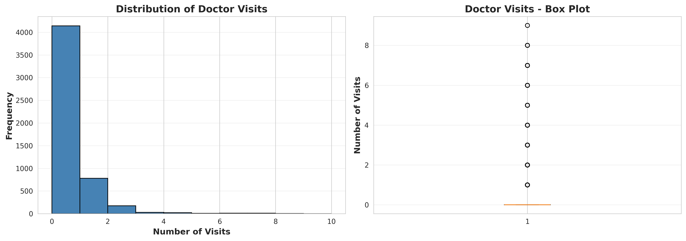
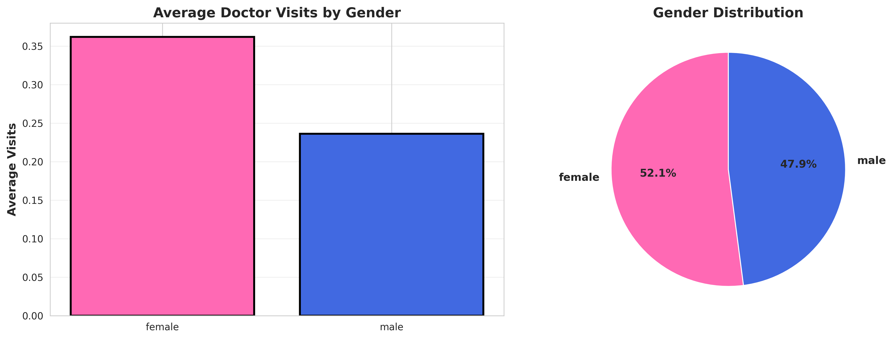
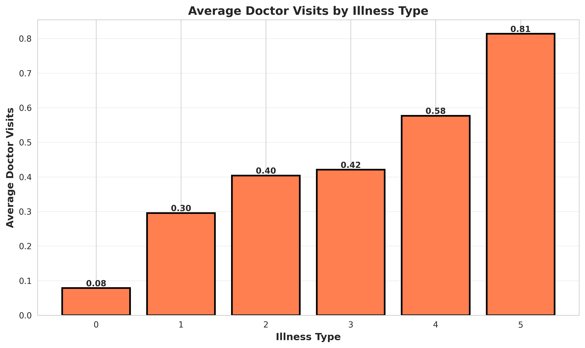
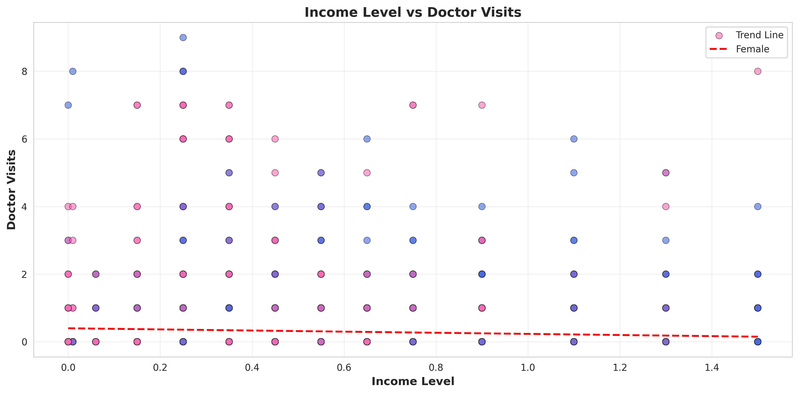
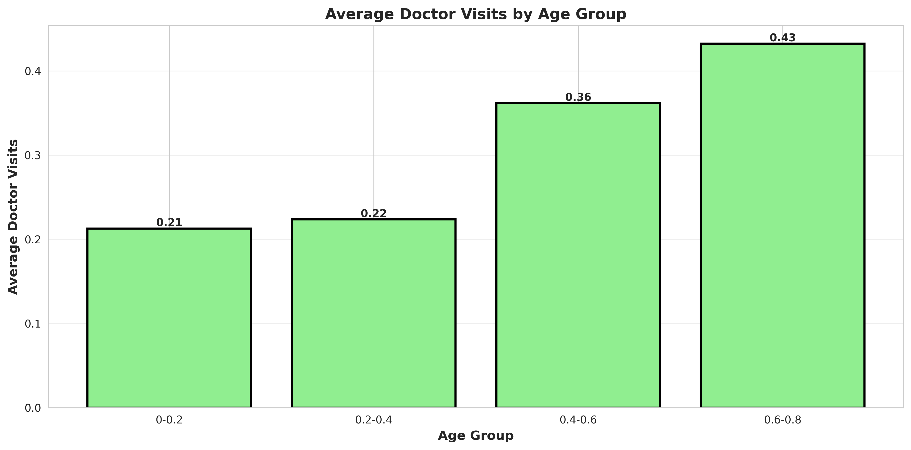
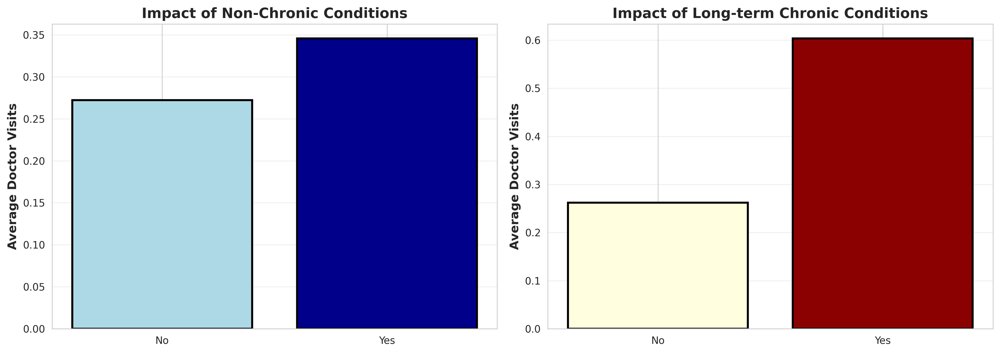
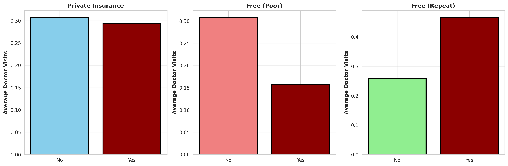
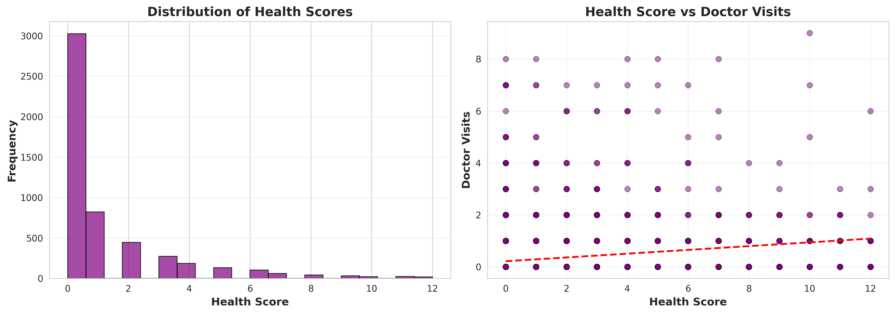
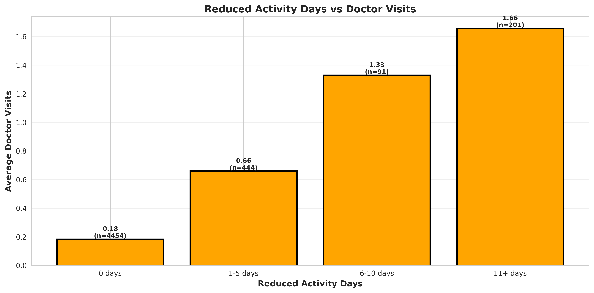
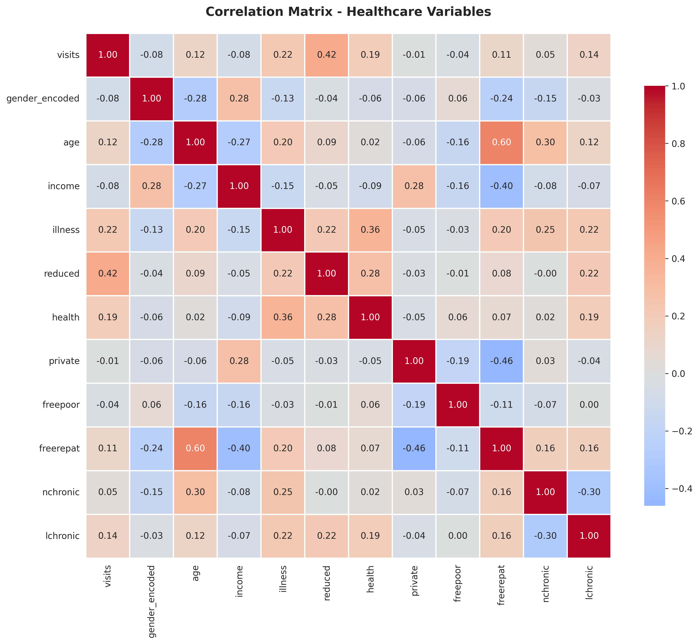

<h1 align="center">🏥 Healthcare Analytics for Doctor Visits</h1>

<p align="center">
  <b>Which factors decide how often a patient visits a doctor?</b><br>
  An end-to-end data analytics project in Python on 5,190 patient records
</p>

<p align="center">
  
  
  
  
  
  
</p>

<p align="center">
  
  
  
</p>

<p align="center">
  <a href="#-project-at-a-glance">Overview</a> •
  <a href="#️-dataset">Dataset</a> •
  <a href="#-methodology">Methodology</a> •
  <a href="#-visualizations">Charts</a> •
  <a href="#-key-findings">Findings</a> •
  <a href="#-how-to-run">How to Run</a>
</p>

---

## 📌 Project at a Glance

<div align="center">

| 👥 Patients | 🧮 Variables | 📊 Charts | 🧹 Missing Values | 🔁 Duplicates |
|:-----------:|:------------:|:---------:|:-----------------:|:-------------:|
| **5,190** | **12** | **10** | **0** | **0** |

</div>

Hospitals and clinics collect large amounts of patient data, but raw records do not explain *why* some people visit a doctor far more often than others. This project cleans a healthcare dataset, explores it with 10 visualizations, measures how each variable relates to the number of doctor visits, and turns the results into clear insights.

> 🎓 **Built as part of:** VOIS For Tech, AICTE TIRTC Data Analytics (August Batch, 2026-27) DIY Project

## 🎯 Objectives

- ✅ Load, inspect and clean the healthcare dataset
- ✅ Understand how doctor visits are distributed across patients
- ✅ Compare visits across gender, age, income, illness score, chronic conditions and insurance type
- ✅ Measure which variables are most strongly related to visits
- ✅ Present the findings in a report and a presentation

## 🗂️ Dataset

| Item | Value |
|------|-------|
| 📄 File | `Healthcare_Analytics_for_Doctor_Visits.csv` |
| 📏 Rows | 5,190 patients |
| 📐 Columns | 13 (1 row-index column + 12 variables) |
| 🎯 Target variable | `visits` (number of doctor visits) |

<details>
<summary><b>📋 Click to see all 12 variables</b></summary>
<br>

| Variable | Type | Range / Values | Meaning |
|----------|------|----------------|---------|
| `visits` | Numeric | 0 to 9 | Number of doctor visits (target) |
| `gender` | Categorical | male / female | Gender of the patient |
| `age` | Numeric | 0.19 to 0.72 | Age (scaled value) |
| `income` | Numeric | 0.0 to 1.5 | Income (scaled value) |
| `illness` | Numeric | 0 to 5 | Illness score |
| `reduced` | Numeric | 0 to 14 | Days of reduced activity |
| `health` | Numeric | 0 to 12 | Health score |
| `private` | Yes / No | 2,298 yes | Has private health insurance |
| `freepoor` | Yes / No | 222 yes | Free government insurance (low income) |
| `freerepat` | Yes / No | 1,091 yes | Free government insurance (other category) |
| `nchronic` | Yes / No | 2,092 yes | Chronic condition (not limiting activity) |
| `lchronic` | Yes / No | 605 yes | Chronic condition (limiting activity) |

> Variable meanings follow the standard description of this dataset. The first column (`Unnamed: 0`) is only a row index and is dropped during cleaning.

</details>

## 🔬 Methodology


<details>
<summary><b>🧹 Data cleaning steps</b></summary>
<br>

- Dropped the unnecessary row-index column
- Checked for missing values and duplicate rows (none found)
- Converted Yes/No columns (`private`, `freepoor`, `freerepat`, `nchronic`, `lchronic`) to 1 / 0
- Created `gender_encoded` (male = 1, female = 0) for correlation, keeping `gender` for chart labels
- Created age groups and reduced-activity groups for clearer category charts
- Saved the result as `Healthcare_Analytics_Cleaned.csv`

</details>

## 📈 Visualizations

### 1️⃣ Doctor Visits Distribution

79.8% of patients had **0 visits**; only 20.2% visited at least once (maximum 9).

### 2️⃣ Visits by Gender

Females average **0.36** visits and males **0.24**. The sample is 52% female (2,702 of 5,190).

### 3️⃣ Illness Score vs Visits

Average visits rise with the illness score, from 0.08 (score 0) to 0.81 (score 5).

### 4️⃣ Income vs Visits

Income has a weak negative link with visits (correlation -0.08).

### 5️⃣ Age Groups vs Visits

Visits rise with age, from 0.21 in the youngest group to 0.43 in the oldest.

### 6️⃣ Chronic Conditions

Patients with a limiting chronic condition average **0.60** visits vs 0.26 without (about 2.3 times). For the non-limiting condition the gap is smaller: 0.35 vs 0.27.

### 7️⃣ Insurance Type

`freerepat` patients average 0.47 visits vs 0.26. `freepoor` patients average 0.16 vs 0.31. Private insurance makes little difference (0.30 vs 0.31).

### 8️⃣ Health Score

Health score and visits are positively related (correlation +0.19). The median score is 0.

### 9️⃣ Reduced Activity Days vs Visits


| Reduced activity days | Patients | Average visits |
|-----------------------|:--------:|:--------------:|
| 0 days | 4,454 | 0.18 |
| 1-5 days | 444 | 0.66 |
| 6-10 days | 91 | 1.33 |
| 11+ days | 201 | 1.66 |

Patients with 11 or more reduced-activity days visit about **9 times** as often as those with none.

### 🔟 Correlation Heatmap

One view of how all variables relate to each other and to `visits`.

## 💡 Key Findings

| # | Finding | Evidence |
|:-:|---------|----------|
| 1 | Most patients rarely see a doctor | 79.8% had 0 visits; average 0.30 per person |
| 2 | 🥇 **Reduced activity days** is the strongest factor | Correlation +0.42; 0.18 to 1.66 visits across groups |
| 3 | Limiting chronic conditions raise visits | 0.60 vs 0.26 visits (about 2.3x) |
| 4 | Illness score matters | Average visits rise from 0.08 to 0.81 |
| 5 | Females visit more than males | 0.36 vs 0.24 visits |
| 6 | Age and income have a weak effect | Correlations +0.13 and -0.08 |
| 7 | Insurance groups behave differently | `freerepat` higher, `freepoor` lower, private about the same |

<details>
<summary><b>🔗 Correlation of every variable with <code>visits</code></b></summary>
<br>

| Variable | Correlation | Strength |
|----------|:-----------:|----------|
| `reduced` | +0.42 | Moderate |
| `illness` | +0.22 | Weak |
| `health` | +0.19 | Weak |
| `lchronic` | +0.14 | Weak |
| `age` | +0.13 | Weak |
| `freerepat` | +0.11 | Weak |
| `nchronic` | +0.05 | Very weak |
| `private` | -0.01 | Very weak |
| `freepoor` | -0.04 | Very weak |
| `income` | -0.08 | Very weak |
| `gender` (male = 1) | -0.08 | Very weak |

</details>

## ✅ Conclusion

Health-related variables, especially **reduced activity days**, the **illness score**, the **health score** and **limiting chronic conditions**, are more closely linked to doctor visits than age, gender or income. A small group of patients with health problems accounts for most of the visits, since about 80% of patients did not visit a doctor at all.

Providers could use simple indicators such as reduced-activity days and chronic-condition status to identify patients likely to need more care.

## ⚠️ Limitations

- The analysis shows **association, not cause and effect**
- About 80% of the target values are 0, so averages are small and the data is highly skewed
- Age and income are scaled values, so charts show relative rather than exact levels
- No prediction model was built; this project is exploratory analysis only

## 📁 Project Structure

```
healthcare-analytics-doctor-visits/
├── README.md
├── Healthcare_Analytics_for_Doctor_Visits.ipynb   # full Colab code
├── data/
│   ├── Healthcare_Analytics_for_Doctor_Visits.csv # original dataset
│   └── Healthcare_Analytics_Cleaned.csv           # cleaned dataset
├── charts/
│   └── chart1_... to chart10_...png               # 10 visualizations
└── docs/
    ├── Healthcare_Analytics_Presentation.pptx     # project presentation
    └── Healthcare_Analytics_Report.pdf            # project report
```

## 🚀 How to Run

1. Open [Google Colab](https://colab.research.google.com) and upload `Healthcare_Analytics_for_Doctor_Visits.ipynb` (**File > Upload notebook**)
2. Upload `data/Healthcare_Analytics_for_Doctor_Visits.csv` using the folder icon on the left
3. Check that the path in the first code cell matches your file name:
   ```python
   df = pd.read_csv('/content/Healthcare_Analytics_for_Doctor_Visits.csv')
   ```
4. Run all cells (**Runtime > Run all**). The 10 charts and the cleaned CSV are saved in the Colab file panel.

## 🛠️ Tech Stack

| Tool | Use |
|------|-----|
| 🐍 Python 3 | Programming language |
| 🐼 Pandas, NumPy | Data loading, cleaning, calculations |
| 📊 Matplotlib, Seaborn | Charts and heatmap |
| ☁️ Google Colab | Cloud notebook environment |

## 👤 Author

**Gajanan Harinarayan Raje**
🎓 TYBCA, MGM's College of Computer Science & IT, Nanded
🏛️ Swami Ramanand Teerth Marathwada University (SRTMU)
🔗 GitHub: [@Gajanan-raje](https://github.com/Gajanan-raje)

---

<p align="center">
  <sub>Built with 🐍 Python | VOIS For Tech DIY Project | 2026-27</sub>
</p>
